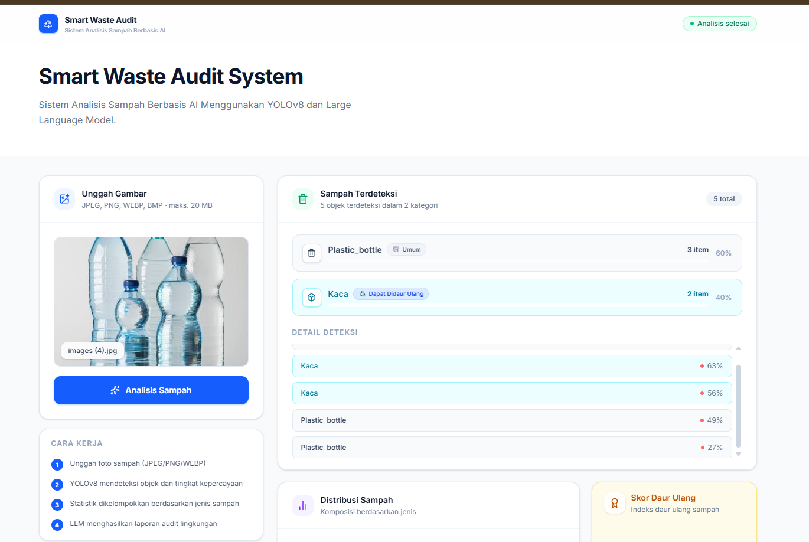
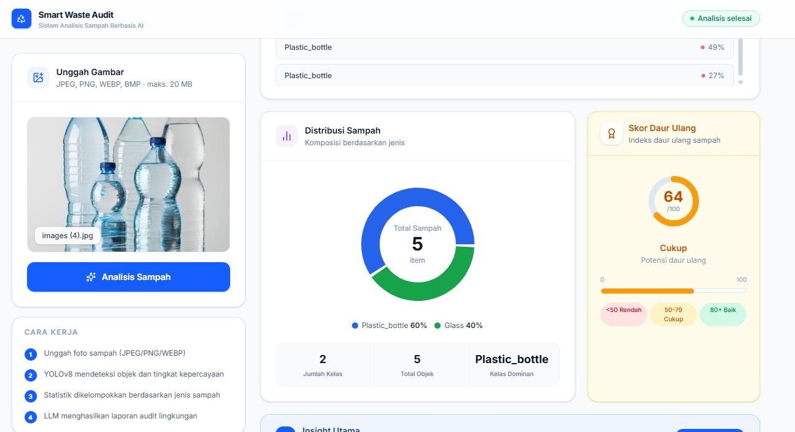
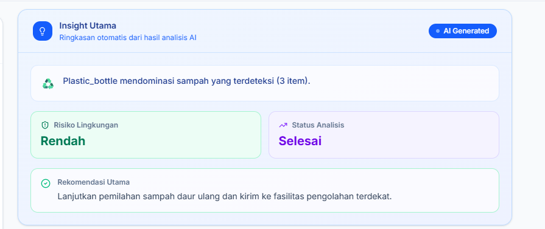
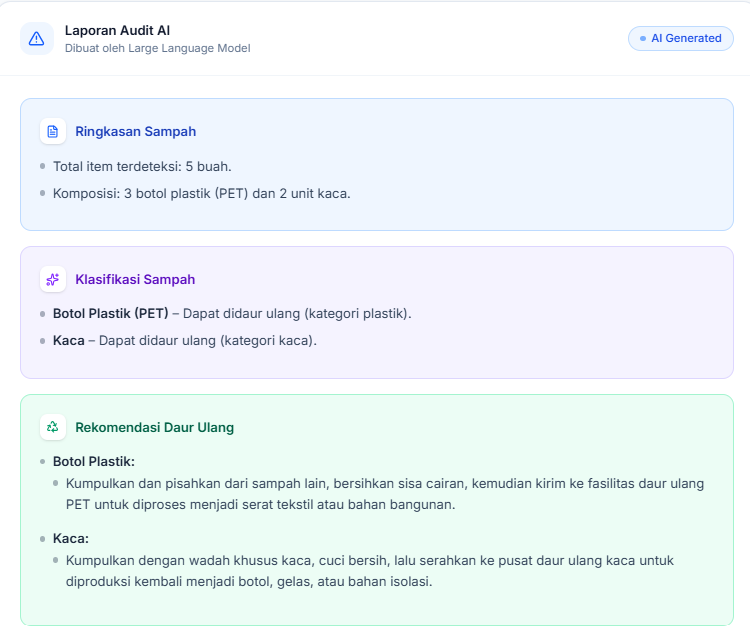
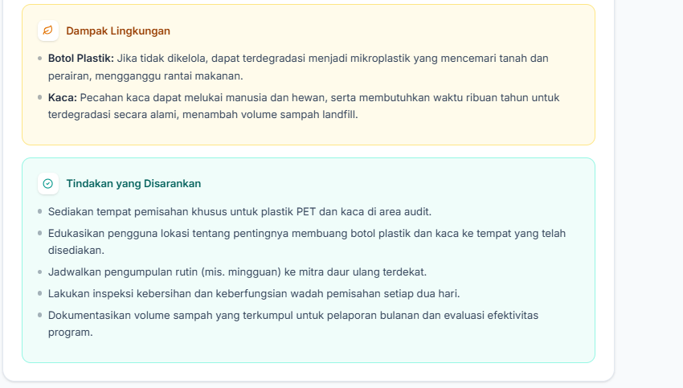

# Smart Waste Audit System

Platform deteksi sampah dan audit lingkungan berbasis AI yang dibangun menggunakan YOLOv8, Ollama Cloud LLM, FastAPI, dan Next.js.

Unggah foto sampah dan sistem akan otomatis mendeteksi objek sampah, mengumpulkan statistik, serta menghasilkan laporan audit lingkungan menggunakan model bahasa besar (LLM).

---

## Tampilan Aplikasi

**1. Halaman Utama — Deteksi Sampah**



**2. Distribusi Sampah dan Skor Daur Ulang**



**3. Insight Utama dari AI**



**4. Laporan Audit AI — Ringkasan dan Rekomendasi Daur Ulang**



**5. Laporan Audit AI — Dampak Lingkungan dan Tindakan yang Disarankan**



---

## Teknologi yang Digunakan

| Lapisan | Teknologi |
|---|---|
| Deteksi Objek | YOLOv8 (model custom `best.pt`) |
| Laporan Audit AI | Ollama Cloud (`gpt-oss:120b`) |
| Backend API | FastAPI + Uvicorn |
| Frontend | Next.js 16 + TypeScript + Tailwind CSS |
| Grafik | Recharts |
| Deployment | Vercel (monorepo) |

---

## Struktur Proyek

```
smart-waste-audit-system/
├── backend/
│   ├── main.py                  # Aplikasi FastAPI — semua route dan Pydantic model
│   ├── services/
│   │   ├── detector.py          # Pemuat model YOLOv8 dan runner inferensi
│   │   ├── statistics.py        # Agregasi sampah dan pembangun prompt LLM
│   │   └── ollama_service.py    # Klien Ollama Cloud (singleton)
│   ├── uploads/                 # Penyimpanan gambar sementara (dihapus otomatis setelah request)
│   ├── .env.example             # Salin ke .env dan isi API key Anda
│   └── requirements.txt
├── frontend/
│   ├── src/
│   │   ├── app/                 # Halaman Next.js App Router
│   │   ├── components/          # Komponen UI (upload card, grafik, laporan audit, dll.)
│   │   ├── lib/                 # Utilitas klien API
│   │   └── types/               # Definisi tipe TypeScript
│   └── package.json
├── model/
│   └── best.pt                  # Bobot model YOLOv8 yang sudah dilatih
└── vercel.json                  # Konfigurasi deployment monorepo Vercel
```

---

## Cara Kerja

Sistem menjalankan pipeline AI dua fase pada setiap gambar yang diunggah:

**Fase 1 — Deteksi** (`POST /api/detect`)

1. Gambar yang diunggah divalidasi (tipe dan ukuran file) lalu disimpan sementara.
2. Model YOLOv8 custom (`best.pt`) menjalankan inferensi dan mengembalikan objek sampah yang terdeteksi beserta skor kepercayaannya.
3. File sementara langsung dihapus setelah inferensi selesai.

**Fase 2 — Audit Penuh** (`POST /api/audit`)

1. Langkah 1-2 dari Fase 1.
2. Hasil deteksi diagregasi menjadi statistik sampah per kelas.
3. Prompt terstruktur dibuat dari statistik tersebut.
4. Prompt dikirim ke **Ollama Cloud** (`gpt-oss:120b`) yang mengembalikan laporan audit lingkungan lengkap.
5. Deteksi, statistik, dan laporan audit dikembalikan dalam satu respons JSON.

```
Request HTTP (gambar multipart)
         |
         v
  +--------------+
  |  Validasi    |  -- Tipe MIME, ekstensi, ukuran file
  +--------------+
         |
         v
  +--------------+
  |   YOLOv8    |  -- detector.py  (best.pt dimuat sekali saat startup)
  |  Inferensi  |
  +--------------+
         |  detections: [{class, confidence}, ...]
         v
  +--------------+
  |  Statistik   |  -- statistics.py  (agregasi murni)
  |  Agregasi   |
  +--------------+
         |  statistics: {plastik: 2, kaleng: 1}
         v
  +--------------+
  | Buat Prompt  |  -- statistics.build_audit_prompt()
  +--------------+
         |  prompt bahasa alami terstruktur
         v
  +--------------+
  | Ollama Cloud |  -- ollama_service.py  (gpt-oss:120b)
  |  gpt-oss    |
  +--------------+
         |  audit_report: "..."
         v
  Respons JSON  {success, detections, statistics, audit_report}
```

---

## Persyaratan Sistem

| Alat | Versi Minimum |
|---|---|
| Python | 3.10 |
| Node.js | 18 |
| pip | 23+ |
| CUDA (opsional) | 11.8+ (akselerasi GPU) |
| Akun Ollama Cloud | https://ollama.com |

---

## Instalasi dan Pengembangan Lokal

### Setup Backend

```bash
cd backend

# Buat dan aktifkan virtual environment
python -m venv venv

# Windows
venv\Scripts\activate

# macOS / Linux
source venv/bin/activate

# Instal dependensi
pip install -r requirements.txt
```

**Konfigurasi variabel lingkungan:**

```bash
# Windows
copy .env.example .env

# macOS / Linux
cp .env.example .env
```

Buka file `.env` dan isi API key Ollama Cloud Anda:

```env
OLLAMA_API_KEY=api_key_anda_di_sini
```

Dapatkan API key di: https://ollama.com/settings/keys

**Jalankan server backend:**

```bash
uvicorn main:app --reload
```

Server berjalan di `http://127.0.0.1:8000`

| URL | Keterangan |
|---|---|
| `http://127.0.0.1:8000/docs` | Dokumentasi interaktif Swagger / OpenAPI |
| `http://127.0.0.1:8000/redoc` | Dokumentasi ReDoc |
| `http://127.0.0.1:8000/health` | Pengecekan status server |

---

### Setup Frontend

```bash
cd frontend

# Instal dependensi
npm install

# Jalankan server pengembangan
npm run dev
```

Frontend berjalan di `http://localhost:3000`

---

## Referensi API

### GET /health

Pengecekan status server — mengembalikan `200 OK` saat model sudah dimuat dan layanan siap.

```json
{ "status": "ok", "message": "AI inference service is running." }
```

---

### POST /detect

Unggah gambar dan terima hasil deteksi YOLOv8 mentah.

**Request**

```
Content-Type: multipart/form-data
Field:        file  (gambar — JPEG, PNG, WEBP, BMP, TIFF, maks. 20 MB)
```

**Respons 200 OK**

```json
{
  "success": true,
  "detections": [
    { "class": "kaleng",   "confidence": 0.93 },
    { "class": "plastik",  "confidence": 0.91 }
  ]
}
```

---

### POST /audit

Pipeline audit penuh — deteksi + statistik + laporan yang dihasilkan AI.

**Request**

```
Content-Type: multipart/form-data
Field:        file  (gambar — JPEG, PNG, WEBP, BMP, TIFF, maks. 20 MB)
```

**Contoh curl**

```bash
curl -X POST "http://127.0.0.1:8000/audit" \
  -H "accept: application/json" \
  -F "file=@/path/ke/gambar.jpg"
```

**Respons 200 OK**

```json
{
  "success": true,
  "detections": [
    { "class": "kaleng",  "confidence": 0.93 },
    { "class": "plastik", "confidence": 0.91 },
    { "class": "plastik", "confidence": 0.88 }
  ],
  "statistics": {
    "plastik": 2,
    "kaleng": 1
  },
  "audit_report": "## Laporan Audit Sampah\n\n**1. Ringkasan Sampah**\n..."
}
```

**Kode error**

| Status | Penyebab |
|---|---|
| `400` | File yang diunggah kosong |
| `413` | Ukuran file melebihi 20 MB |
| `415` | Tipe atau ekstensi file tidak didukung |
| `503` | Ollama Cloud tidak dapat dijangkau atau API key tidak valid |
| `500` | Error inferensi YOLO atau kesalahan server yang tidak terduga |

---

## Konfigurasi

| Pengaturan | Default | Cara Mengubah |
|---|---|---|
| Path model | `../model/best.pt` | Edit `MODEL_PATH` di `services/detector.py` |
| Model Ollama | `gpt-oss:120b` | Edit `OLLAMA_MODEL` di `services/ollama_service.py` |
| Host Ollama | `https://ollama.com` | Edit `OLLAMA_CLOUD_HOST` di `services/ollama_service.py` |
| Direktori upload | `backend/uploads/` | Edit `UPLOAD_DIR` di `main.py` |
| Ukuran file maksimum | 20 MB | Edit `MAX_FILE_SIZE_BYTES` di `main.py` |
| Origin CORS | `http://localhost:3000` | Edit `allow_origins` di `main.py` |
| Port server | `8000` | Tambahkan `--port N` saat menjalankan uvicorn |

---

## Deployment ke Vercel

Proyek ini dikonfigurasi untuk deployment monorepo Vercel melalui `vercel.json`. Frontend dan backend di-deploy sebagai layanan terpisah dari repositori yang sama.

```json
{
  "experimentalServices": {
    "frontend": {
      "root": "frontend",
      "framework": "nextjs",
      "routePrefix": "/"
    },
    "backend": {
      "root": "backend",
      "framework": "fastapi",
      "entrypoint": "main.py",
      "routePrefix": "/api"
    }
  }
}
```

Pastikan variabel `OLLAMA_API_KEY` sudah diatur di pengaturan environment Vercel sebelum melakukan deployment.

---

## Catatan Penting

- Gambar yang diunggah dihapus otomatis setelah setiap request — tidak ada data yang disimpan permanen.
- Model YOLOv8 (`best.pt`) dimuat sekali saat startup, sehingga tidak ada overhead tambahan per request.
- GPU digunakan secara otomatis jika CUDA tersedia; jika tidak, sistem akan menggunakan CPU.
- Endpoint `/audit` mengembalikan HTTP `503` (bukan `500`) saat Ollama tidak tersedia, sehingga frontend dapat menangani gangguan LLM tanpa menyembunyikan hasil deteksi YOLO.
- Endpoint `/detect` tetap berfungsi penuh meskipun tanpa Ollama API key.
- File `OLLAMA_API_KEY` di `.env` sudah dikecualikan dari version control melalui `.gitignore`.

---

